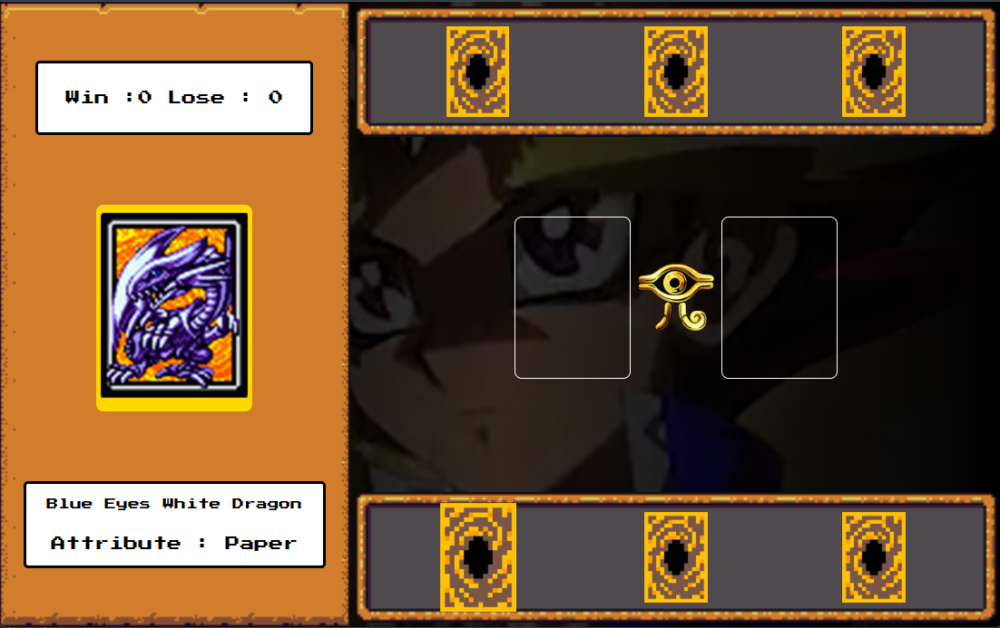

# 🎮 Yu-Gi-Oh | Jo-ken-po Edition
Jogo inspirado no universo de Yu-Gi-Oh com a mecânica de Jo-ken-po (Pedra, Papel e Tesoura)

## **🚀 Tecnologias usadas**

## **🧠 O que eu pratiquei**
- Organização e estruturação de um projeto web
- Manipulação do DOM com JavaScript
- Estrutura condicional para lógica de jogo
- Implementação de efeitos sonoros com eventos
- Animação de fundo com vídeo em loop
- Implementação de estado do jogo e placar dinâmico

## 🖥️ Preview do Jogo

## 🕹️ Como Jogar

1. Escolha uma das cartas do seu lado (lado esquerdo).
2. A máquina irá escolher uma carta aleatória.
3. As cartas irão para o campo de batalha.
4. O resultado será exibido (Vitória, Derrota ou Empate).
5. Ao final, clique em "GANHOU" para jogar novamente.

<h3>As cartas funcionam com base no tradicional pedra-papel-tesoura: </h3>
 
 - 🪨 Pedra (Dark Magician) vence Tesoura
 - ✂️ Tesoura (Exodia) vence Papel
 - 📄 Papel (Blue Eyes White Dragon) vence Pedra

## 🔊 Efeitos Sonoros

O jogo conta com:
- Música de fundo inspirada no universo egípcio
- Sons distintos para vitória, derrota

 🎧 Ative o som para uma experiência completa!

> 💡[Clique aqui para jogar online](https://mirellanovroch.github.io/yugioh-card-game-project/)
 

> 📌 Este projeto ainda está em desenvolvimento e continuará recebendo melhorias conforme avanço nos meus estudos.

## ✍️  Créditos
Este jogo foi desenvolvido como parte de um projeto educacional da [Digital Innovation One](https://www.dio.me/).